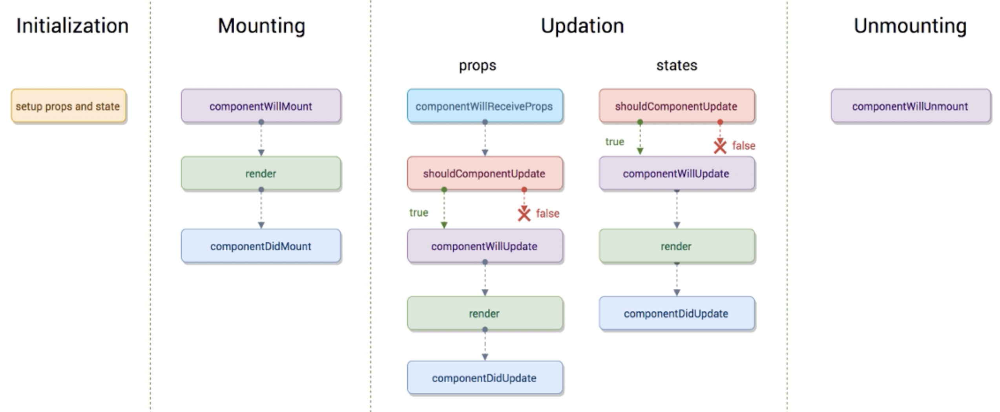

# `ShouldComponentUpdate(nextProps, nextState)` Metodu

Componentin render edilip, edilmeyeceğine karar vermemizi sağlar.
`true` dönerse component `render` edilir.
1. <code>state</code> ile `fiyat` değişkenini `0` olarak ayarlıyoruz. (`constructor` içinde `this.state` ile de yapabiliriz.)
2. `<input name="fiyat" id="fiyat" />` ile fiyat giriş alanı sağlıyoruz.
3. `<p>{this.state.fiyat / 5} tane portakal alınabilir</p>` ile gösterim yapıyoruz.
4. **`fiyat`** değişkeni state'inin güncellenmesi için;
    * `<input name="fiyat" id="fiyat" onChange={this.changeFiyat} />` **onChange** olayı
    için <code>changeFiyat</code> fonksiyonunu geçiyoruz.
    * changeFiyat() fonksiyonunu bind etmeden kullanmak için `arrow` fonksiyon olarak
    tanımlıyouruz. Diğer türlü `constructor` içinde <code>this.onChange = this.changeFiyat.bind(this)</code> şeklinde bind etmemiz gerekirdi.
    ```js script 
    changeFiyat = (e) => {
        ......
    };
    ```
    * changeFiyat() fonksiyonu içinde `setState` durumunu  <code>fiyat: e.target.value,</code> olarak set ediyoruz.
5. componentin sadece fiyatın 5 ve katları şeklinde render edilebilmesi için;
    * **`scu`** kısayoluyla <code>shouldComponentUpdate(nextProps, nextState) {return ...}</code> fonksiyonunu kuruyoruz.
    * nexstate.fiyat değişkeninin 5'e bölümü `0` ise, componentin render edilmesini yani fiyat hesaplamasını sağlıyoruz. <code>return nextState.fiyat % 5 === 0;</code>

```js script
class App extends Component {
  state = {
    fiyat: 0,
  };
  changeFiyat = (e) => {
    this.setState({
      fiyat: e.target.value,
    });
  };

  shouldComponentUpdate(nextProps, nextState) {
    //console.log(`shouldComponentUpdate nextProps:`, nextState);
    return nextState.fiyat % 5 === 0; // 5 ve katları şeklinde portakal alınmasını istiyoruz.
  }

  render() {
    return (
      <div className="App">
        <br />
        <input name="fiyat" id="fiyat" onChange={this.changeFiyat} />

        <strong>Her Portakal 5 TL</strong>
        <br />

        <p>{this.state.fiyat / 5} tane portakal alınabilir</p>
      </div>
    );
  }
}
export default App;
```
## `componentWillUpdate` ve `componentDidUpdate` Metodu

* **<code>componentWillUpdate(nextProps, nextState)</code>** metodu render'den önce,
* **<code>componentDidUpdate(prevProps, prevState)</code>** metodu render'den sonra çalışır.


