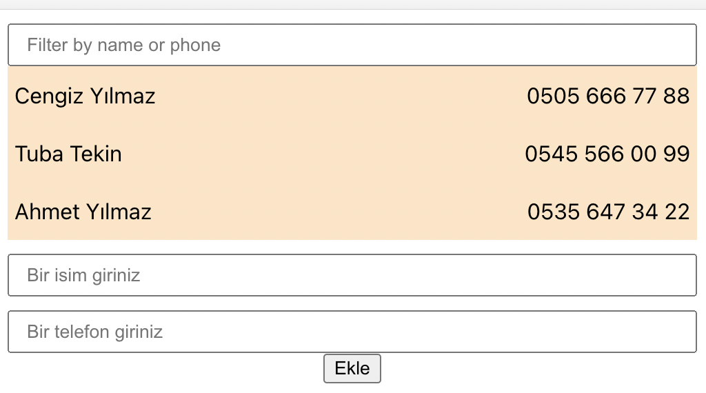

# Uygulamalı ReactJs Eğitimi 15.5 saat

React 17'den React 18'e geçiş.
**index.js** dosyası içindeki kodların değişimi
```js script
import React from "react";
//import ReactDOM from "react-dom"; //React 17
import { createRoot } from "react-dom/client"; //React 18
import "./index.css";
import App from "./App";

const container = document.getElementById("root");
const root = createRoot(container);

root.render(
  <React.StrictMode>
    <App />
  </React.StrictMode>
);

//React 17 sürümü
ReactDOM.render(
  <React.StrictMode>
    <App />
  </React.StrictMode>,
  document.getElementById("root")
);
```



Formdan girilen verileri ekrana bastırmak için 

1. **App.js**'te iken

```js script
  addContact(e) {
    
  }
```

diye bir fonksiyon tanımlanır.

2. **App.js**'te iken, bu fonksiyon Contacts componentine props ile geçilir.
```js script
      <div className="App">
        <Contacts addContact={this.addContact} contacts={this.state.contacts} />
      </div>
```
3. Props olarak tanıttıktan sonra bunu constructor ile bağlamalıyız. ***constructor*** kısayolu *ctor* dur.
```js script
  constructor(props)
  {
    super(props);
    this.addContact = this.addContact.bind(this); 
  }
```
4. **Contact.js** componentinde *PropTypes*'leri ayarlıyoruz. 
Başvurusunu bu şekilde ekliyoruz. <code>import PropTypes from 'prop-types';</code>
```js script
    // export default Contacts; buradan hemen önceye bu kodu girilir. 
    //Yani Contacts componentinin bitişine.
    Contacts.propType = {
        contacts: PropTypes.array.isRequired,
        addContact: PropTypes.func, // addContact fonksiyon olduğundan
    };
```
5. **Contact.js** içinde *Form* componentine, props olarak gelen
addContact propsunu yine props olarak tanımlıyoruz.
```js script
  <Form addContact={this.props.addContact}/>
```
