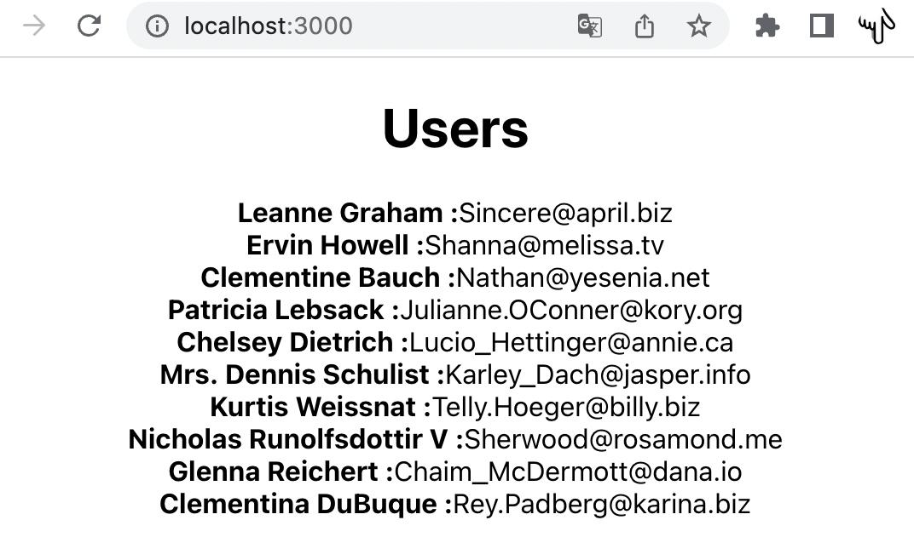

# Api ile veri çekme

## [jsonplaceholder.typicode.com](https://jsonplaceholder.typicode.com)'dan veri çekme

https://jsonplaceholder.typicode.com/users alanından veri çekmeye çalışalım.

1. **state** içinde users değişkeni dizi olarak tanımlanır.

```js script
  constructor(props) {
    super(props);

    this.state = {
      users:[],
    };
  }
```

2. <code>render()</code> alanından hemen önce, **cdm** kısayoluyla **componentDidMount()** fonksiyonu yazılır.
3. [jsonplaceholder.typicode.com](https://jsonplaceholder.typicode.com) sitesindeki api kullanım örneği alınır.

```js script
fetch("https://jsonplaceholder.typicode.com/todos/1")
  .then((response) => response.json())
  .then((json) => console.log(json));
```

4. Bunun içinde, JSON tipinde çekilen veri, <code>this.setState</code> (kısayolu _sst_) ile users array'ine atanır.

```js script
componentDidMount() {
    fetch("https://jsonplaceholder.typicode.com/users")
      .then((response) => response.json())
      .then(data =>
        {
            this.setState(
              {
                users: data,
              }
            );
      });
  }
```
5. Son olarak render() içine gösterim yapılır.

```js script
  render() {
    return (
      <div className='App'>
        <h1>Users</h1>
        {
            this.state.users.map((user) => (
              <div key={user.id}>
                <strong> {user.name} : </strong>
                {
                  user.email
                }
              </div>
            ))
        }
      </div>
    );
  }
```
<ins>**Sonuç**</ins>
<hr/>
 
 