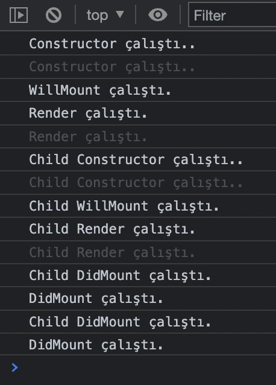
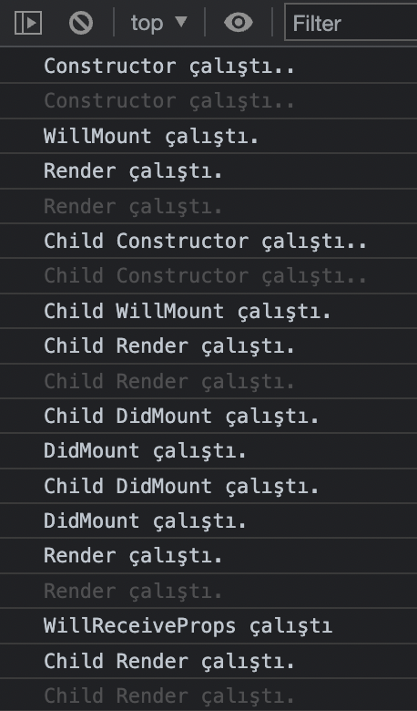

# LifeCycle / Yaşam Döngüsü
## componentWillMount, componentDidMount

** 48. Ders **

1. İlkönce **conctructor()** metodu çalışır.
2. Sonra **componentWillMount()** metodu çalışır.
3. Sonra **render()** metodu çalışır.
4. Sonra **componentDidMount()** metodu çalışır.

### DidMount Metodu
Burada **DidMount** metodunu 4 saniye sonra çalıştırdığımızda;
ilk olarak render metodundan hemen sonra çalışacak. 
İkinci olarak da 4 saniye gecikmeli olarak **render()** metodunu tekrar çalıştırıp, 
sonra da **componentDidMount()** metodu çalışacaktır.
```js script
componentDidMount(){
    console.log("DidMount çalıştı.");
    // 4 saniye sonra metodu çalıştıracaz. Böylece Render 2 kere çalışacak.
    setTimeout(() => {
      this.setState({
        favorirengim: 'Mavi',
      })
    }, 4000);
    // Renderden sonra bir güncelleme istiyorsak bu önemli yapıyı kullanabiliriz.
  }
```
Tam Kod
```js script
class App extends Component {
  constructor(props)
  {
    console.log('Constructor çalıştı..')
    super(props);
    this.state = {
      favorirengim:'Kırmızı'
    }
  }

  componentWillMount(){
    console.log("WillMount çalıştı.");
  }

  componentDidMount(){
    console.log("DidMount çalıştı.");
    // 4 saniye sonra metodu çalıştıracaz. Böylece Render 2 kere çalışacak.
    setTimeout(() => {
      this.setState({
        favorirengim: 'Mavi',
      })
    }, 4000);
    // Renderden sonra bir güncelleme istiyorsak bu önemli yapıyı kullanabiliriz.
  }

  render() {
    console.log('Render çalıştı.')
    return (
      <div>
        Favori Rengim {this.state.favorirengim}
      </div>
    )
  }
}
export default App;
```
## Hiyerarşik Yapı

**Child** componenti de **App** componentinin aynısı, burada hiyerarşiye dikkat.
```js script
class App extends Component {
  constructor(props)
  {
    console.log('Constructor çalıştı..')
    super(props);
  }

  componentWillMount(){
    console.log("WillMount çalıştı.");
  }

  componentDidMount(){
    console.log("DidMount çalıştı."); 
  }

  render() {
    console.log('Render çalıştı.')
    return (
      <div>
        <Child />
      </div>
    )
  }
}
export default App;
```


### WillReceiveProps metodu

**React 18'de** kaldırıldı. Props değiştiğinde tetiklenir.

