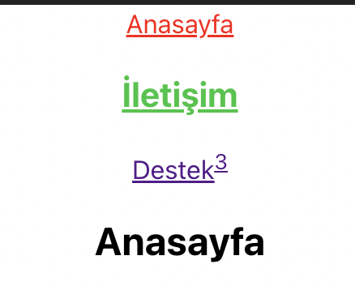

# `React Router`

### Kurulum

`npm i react react-dom react-router-dom`

#### <u>`Nasıl import edilir?`</u>

<code>import { BrowserRouter as Router, Routes, Route } from "react-router-dom";</code>

- App.js içindeki ana kapsayıcı `BrowserRouter` olmalıdır.
- `BrowserRouter as Router` şeklinde de kısaltılabilir.
- `Router` kapsayıcısının içine `<Routes> ... </Routes>` tanımlanır.
- `<Routes> ... </Routes>` içinde ihtiyaç duyulduğu kadar `Route` tanımlanabilir.

### `Route kullanım şekli`

```js script
    <Route path="/" element={<Anasayfa />} />
    <Route path="iletisim" exact element={<Iletisim />} />
    <Route path="destek" element={<h2>Destek</h2>} />
```

### <u>`Tam Gösterim - Route kullanım şekli`</u>

```js script
class App extends Component {
  render() {
    const Anasayfa = () => {
      return <h2>Anasayfa</h2>;
    };

    const Iletisim = () => {
      return <h3>İletişim</h3>;
    };

    return (
      <Router>
        <div className="App">
          <Routes>
            <Route path="/" exact element={<Anasayfa />} />
            <Route path="iletisim" element={<Iletisim />} />
            <Route path="destek" element={<h2>Destek</h2>} />
          </Routes>
        </div>
      </Router>
    );
  }
}
```
## `Route ile parametre gönderme`

* App.js içinde `render()`'den hemen sonra, const ifadesiyle arrow function tipinde menü tanımlıyoruz.
* Bu fonksiyon içinde `import` ettiğimiz **useParams'a** `let` ile **id** parametresini eşitliyoruz.
```js script
let {id} = useParams();
```
* Fonksiyonu **return** ederken URL'de `id` kullandığımız ID'nin gösterimini <code>{id}</code> şeklinde aşağıda görüldüğü gibi yapabiliriz.
```js script
return <h3>İletişim: {id}</h3>;
```
* Son olarak `Route` componenti içindeki gösterim 
`<Route path="/iletisim/:id" element={<Iletisim />} />` şeklinde olmalıdır.

### <u>`Tam Gösterim - Route ile parametre gönderme`</u>
```js script
import React, { Component } from "react";
import { BrowserRouter as Router, Routes, Route, useParams } from "react-router-dom";

class App extends Component {
  render() {

    const Iletisim = () => {
      let { id } = useParams();
      return <h3>İletişim: {id}</h3>;
    };

    return (
      <Router>
        <div>
          <Routes>
            <Route path="iletisim" element={<h3>İletişim</h3>} />
            <Route path="/iletisim/:id" element={<Iletisim />} />
          </Routes>
        </div>
      </Router>
    );
  }
}

export default App;
```
## `Link ve NavLink kullanım örnekleri`
* Link HTML'deki `<a href=""></a>` tagına denk gelir.
* `NavLink`, Link elementinin ***class*** veya ***style*** verilebilen tipidir.
* `Routes` dışında tanımlanır.
```js script
// Kullanım örnekleri,
// App.css içinde .iletisim{ color: rgb(16, 197, 61);font-size: large;}

    <NavLink to="/" style={{ color: "red" }} >Anasayfa</NavLink>
    <NavLink to="/iletisim" className='iletisim' ><h3>İletişim</h3></NavLink>
    <Link to="destek" >{<u>Destek<sup>3</sup></u>}</Link>
```
 