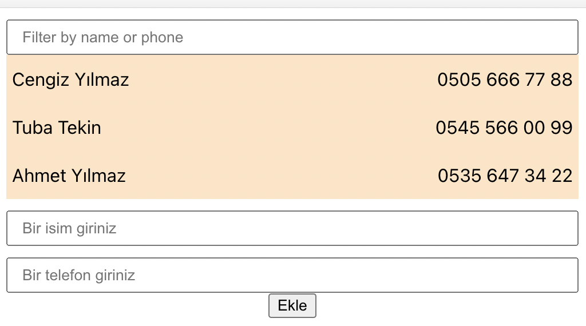
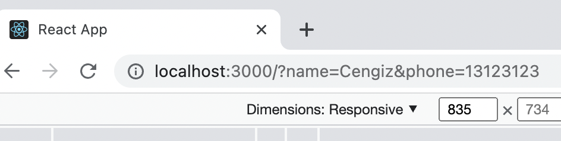
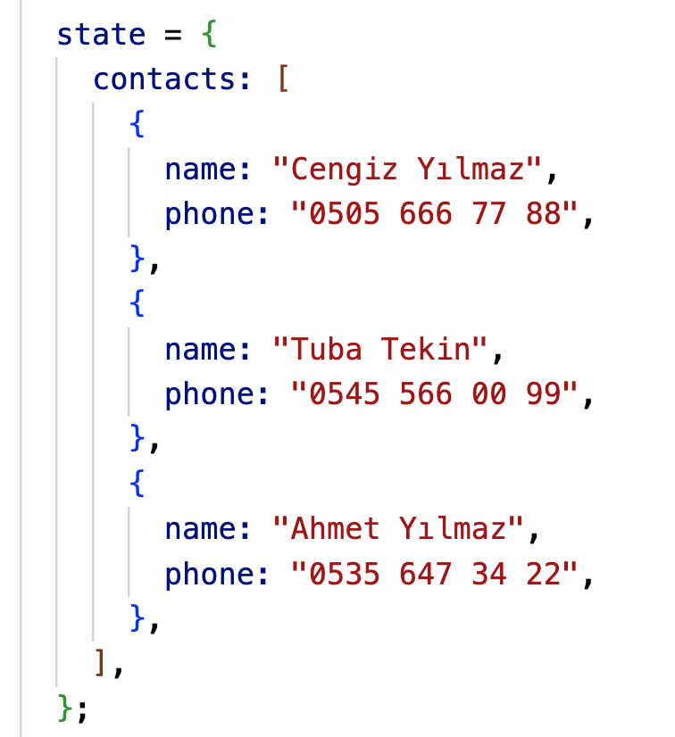
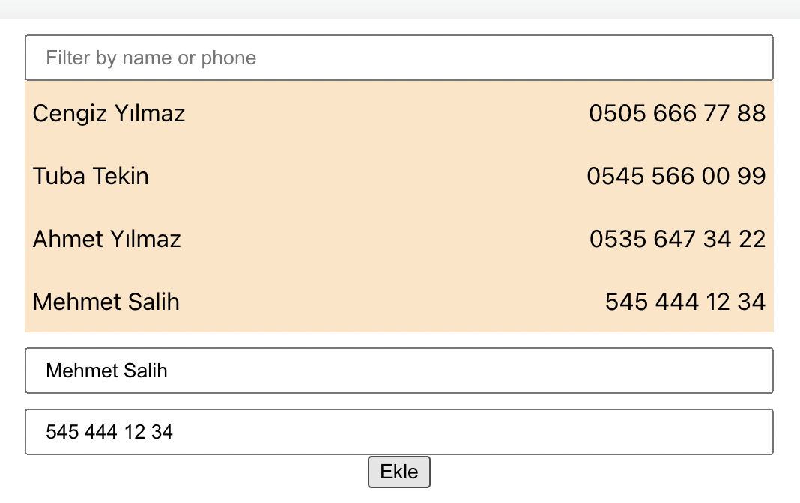
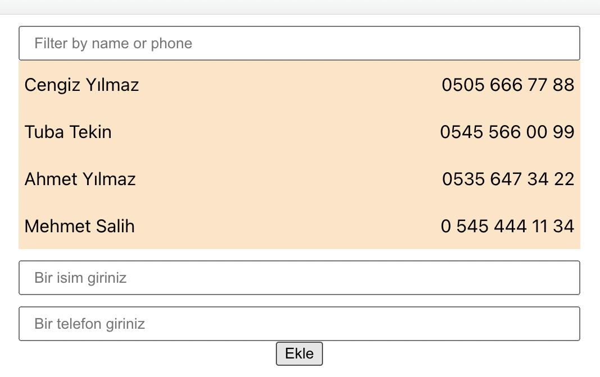

- En önemli derslerden biri, iyice kavramak gerekiyor.



Formdan girilen verileri ekrana bastırmak için

1. **App.js**'te iken

```js script
  addContact(e) {

  }
```

diye bir fonksiyon tanımlanır.

2. **App.js**'te iken, bu fonksiyon Contacts componentine props ile geçilir.

```js script
<div className="App">
  <Contacts addContact={this.addContact} contacts={this.state.contacts} />
</div>
```

3. Props olarak tanıttıktan sonra bunu constructor ile bağlamalıyız. _constructor_ kısayolu _ctor_ dur.

```js script
constructor(props);
{
  super(props);
  this.addContact = this.addContact.bind(this);
}
```

4. **Contact.js** componentinde _PropTypes_'leri ayarlıyoruz.
   Başvurusunu bu şekilde ekliyoruz. <code>import PropTypes from 'prop-types';</code>

```js script
// export default Contacts; buradan hemen önceye bu kod girilir.
//Yani Contacts componentinin bitişine.
Contacts.propType = {
  contacts: PropTypes.array.isRequired,
  addContact: PropTypes.func, // addContact fonksiyon olduğundan
};
```

5. **Contact.js** içinde _Form_ componentine, props olarak gelen
   addContact propsunu yine props olarak tanımlıyoruz.

```js script
<Form addContact={this.props.addContact} />
```

6. Url'mizin resimdeki şekilde değilde, "http://localhost:3000/" şeklinde kalmasını istiyoruz.

   

```js script
onSubmit(e);
{
  e.preventDefault();
}
```

kodunu yazıyoruz.

7. Bu aşamada state değerlerini props alanlarına atıyoruz.

**Form.js**'deyken <code>veriGir()</code> fonksiyonu ile
state'timize değerleri giriyorduk.

```js script
veriGir(e);
{
  this.setState({
    [e.target.name]: e.target.value,
  });
}
```

State'timizdeki bu değerleri, props olarak gelen **this.addContact** propsuna
<code>...this.state</code> kodu ile gönderiyoruz.

Böylece _'name'_ ve _'phone'_ alanlarına state içindeki değerleri atıyoruz.

Bunu console'dan <code>console.log({...this.state})</code> ile görebiliriz.

Nihai kodumuz şu şekilde;

```js script
onSubmit(e);
{
  e.preventDefault();
  //console.log({...this.state});
  this.props.addContact({
    ...this.state,
  });
}
```

Formdan girilen değerlerin **this.addContact** propsumuza
gidip gitmediğini anlamak için **App.js** ye gidip,

```js script
addContact(contact) {
    console.log(contact);
 }
```

formdan veri girip console'dan görebiliriz.

8. **App.js** içindeki App componentine değerleri gönderdik.
   **addContact()** fonksiyonu ile state içindeki dizimizin sonuna değerleri eklemeliyiz.
   

- İlk önce state verilerini <code>contacts</code> dizimize state'i eşitliyoruz.

```js script
  addContact(contact) {
    //console.log(contact);
    const {contacts} = this.state;
  }
```

- İkinci adımda javascript **_push_** metoduyla dizinin sonuna değerleri ekliyoruz.

```js script
  addContact(contact) {
    //console.log(contact);
    const {contacts} = this.state;
    contacts.push(contact);
  }
```

- Üçüncü adımda da eklenen değerlerin, ekranda gözükmesi için <code>this.setSate({})</code> yapıyoruz.

```js script
  addContact(contact) {
    //console.log(contact);
    const {contacts} = this.state;
    contacts.push(contact);
    this.setState(
      {
        contacts:contacts, // contacts, eklemiş olduğumuz contacts'a eşit olsun. Yani push edilen değerlere eşitle.
      }
    );
  }
```
* Son adımda formdaki veriyi gönderdikten sonra giriş alanların temizlenmesi gerekiyor. 
  

Submit edildikten sonraki durum kodunu eklemeliyiz.

```js script
 onSubmit(e)
 {
    e.preventDefault();
    this.props.addContact(
      {
          ...this.state
      }
    );
    //Submit edildikten sonraki durum
    this.setState(
      {
        name:'',
        phone:''
      }
    )
 };
 ```
 ve sonuç ...
